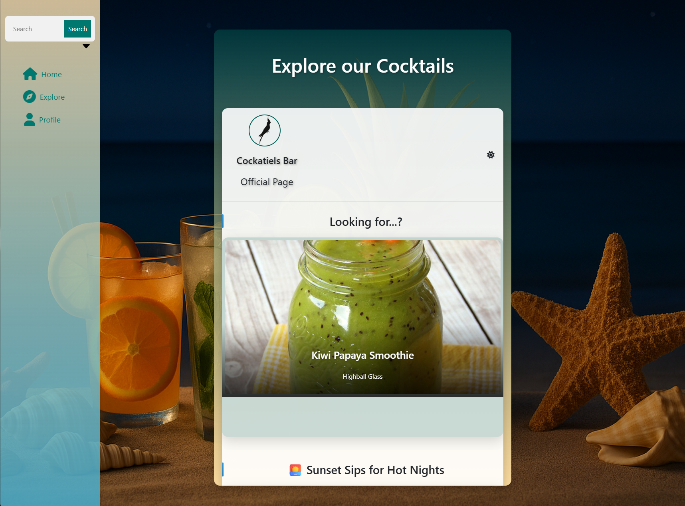

per far partire il programma spostarsi in [CocktailDebacle](./Main/SfidaTerranova/CocktailDebacle/) `~CockatielBarV1.0\Main\SfidaTerranova\CocktailDebacle\`

digitare docker-compose up --build
N.B (è necessario un servizio Docker, es. Docker-Desktop)
aspettare il completamento del compose--
connettersi a :
```
http://localhost:4200/
```

IN ALTERNATIVA (con i giusti servizi installati -- dotnet, angular, sqlserver etc. -- )

andare su [CocktailDebacle.Server](./Main/SfidaTerranova/CocktailDebacle/CocktailDebacle.Server/) 
e avviare il back-end con dotnet watch run (è possibile che sia necessario prima eseguire migrazione e update del database -- è possibile farlo tramite)

### !!! Attenzione che la stringa di connessione sia [locale](#local-connection-immetti-il-nome-del-tuo-server) !!!
```powershell
# Eseguire una nuova migrazione
dotnet ef migrations add NOME_MIGRAZIONE
# Applicare la migrazione al database
dotnet ef database update
```

una volta che il servizio è in ascolto, dopo che si sarà aperto lo swagger,
andare nella cartella  [cocktaildebacle.client](./Main/SfidaTerranova/CocktailDebacle/cocktaildebacle.client/)  e digitare
ng serve --host 0.0.0.0 --poll 
infine collegati a  
```
http://localhost:4200/
```

N.B 
per permettere al programma di comunicare con il database andrà settata la stringa di connessione in [appsettings.json](./Main/SfidaTerranova/CocktailDebacle/CocktailDebacle.Server/appsettings.json) in base all'ambiente di sviluppo

---
## Docker Connection
```json
"DefaultConnection": "Server=sqlserver;Database=CocktailDb;User Id=sa;Password=YourStrong!Passw0rd;TrustServerCertificate=true;"
```
---
## Local Connection (immetti il nome del tuo server)
```json
"DefaultConnection": "Server=NameServer; Database=CocktailDebacle; Trusted_Connection=true; TrustServerCertificate=True; MultipleActiveResultSets=True;"
```

---
# [Documentazione Progetto (Click Here)](./Project-description/)
