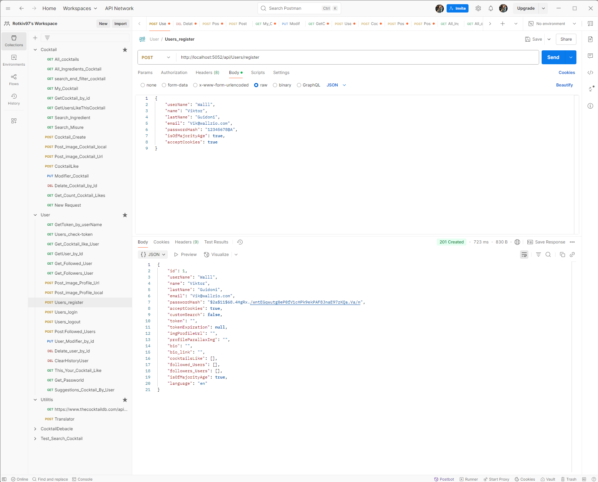

# API del progetto e come testarle su Postman

# Inserise i Token su postoman 

## 🍸 API Cocktail
- [GET - http://localhost:5052/api/Cocktails/cocktails](#get-all-cocktail)
- [GET - http://localhost:5052/api/Cocktails/cocktail/by-id](#cocktail-by-id)
- [GET - http://localhost:5052/api/Cocktails/search](#my-cocktails)
- [GET - http://localhost:5052/api/Cocktails/IngedientSearch/SearchIngredient](#)
- [GET - http://localhost:5052/api/Cocktails/SearchMeasureType/searchMeasure](#)
- [GET - http://localhost:5052/api/Cocktails/SearchGlass/searchGlass](#)
- [GET - http://localhost:5052/api/Cocktails/SearchCategory/searchCategory](#)
- [GET - http://localhost:5052/api/Cocktails/GetUserCocktailLikes](#)
- [GET - http://localhost:5052/api/Cocktails/GetCountCocktailLikes/{id}](#)
- [GET - http://localhost:5052/api/Cocktails/ingredients](#)
- [GET - http://localhost:5052/api/Cocktails/SearchUser/{username}](#)

- [POST - http://localhost:5052/api/Cocktails/CocktailCreate](#)
- [POST - http://localhost:5052/api/Cocktails/{id}/UploadImageCocktail-local](#)
- [POST - http://localhost:5052/api/Cocktails/{id}/UploadImageCocktail-url](#)

- [PUT - http://localhost:5052/api/Cocktails/CocktailUpdate/{idDrink}](#)

- [DELETE - http://localhost:5052/api/Cocktails/CocktailDelete/{idDrink}](#)

## 👤 API Users
- [GET - http://localhost:5052/api/Users/GetUser/{username}](#)
- [GET - http://localhost:5052/api/Users/check-token](#)
- [GET - http://localhost:5052/api/Users/GetToken](#)
- [GET - http://localhost:5052/api/Users/getPassword/{id}](#)
- [GET - http://localhost:5052/api/Users/GetMyCocktailLike/{id}](#)
- [GET - http://localhost:5052/api/Users/GetFollowedUsers/{id}](#)
- [GET - http://localhost:5052/api/Users/GetFollowersUsers/{id}](#)
- [GET - http://localhost:5052/api/Users/Get_Cocktail_for_Followed_Users](#)
- [GET - http://localhost:5052/api/Users/ThisYourCocktailLike/{id}](#)
- [GET - http://localhost:5052/api/Users/SuggestionsCocktailByUser/{id}](#)

- [POST - http://localhost:5052/api/Users/login](#)
- [POST - http://localhost:5052/api/Users/logout](#)
- [POST - http://localhost:5052/api/Users/register](#)
- [POST - http://localhost:5052/api/Users/upload-profile-image-local/{id}](#)
- [POST - http://localhost:5052/api/Users/upload-profile-image-Url/{id}](#)
- [POST - http://localhost:5052/api/Users/FollowedNewUser/{followedUserId}](#)

- [PUT - http://localhost:5052/api/Users/{id}](#)

- [DELETE - http://localhost:5052/api/Users/{id}](#)

## 🌍 API Translation
- [POST - http://localhost:5052/api/Translation/translate](#)

### Get All Cocktail

#### non ha bisono di nulla in ingresso semplicemente ti rende tutti i cocktial presenti nel database in una lista di oggetti DTO quindi solo con le informazioni che mi servono sapere

### Cocktail By Id

http://localhost:5052/api/Cocktails/cocktail/by-id?id={id} 
in postman se vogli aggingere id token vai su Authorization -> su Auth Type = Bearer Token, prendere il token dell'user e incollarlo dentro la sezione token
questa chiamata a bisogno dell'id del cocktail e in manira opzionale il TOKEN per controllare se sei autenticato e autorizzato, per poi tornarmi sempre un oggetto DTO del cocktail trovato nel database, altrimenti mi ritorna un NotFound( ), questa chiamata viene usata alla fine di una ricerca nel FrontEnd e se hai accetto i cockie e sei aoutorizzato dai token allora il nome del cocktail viene salavata nel UserHistorySearch dove mi salvo l'id del l'user il nome del Cocktail e la data delle ricercha.

### Search

questa chiamata è una chiamata che tramite delle query mi permette di filtrare e cercare

nameCocktail: Nome del cocktail
UserSearch: Nome dell’utente che ha creato il cocktail
glass: Tipo di bicchiere
ingredient: Nome dell’ingrediente contenuto
category: Categoria del cocktail
alcoholic: (valori accettati: Non Alcoholic, Alcoholic, Optional alcohol)
page: Numero della pagina
pageSize: Dimensione della pagina

Questa chiamata l'ho pensata inizialmente anche per una ricerca combinata per poi essere usata con una query alla volta.

esempio di chiamata :  http://localhost:5052/api/cocktails/search?ingredient=Vodka&page=1&pageSize=10

### My Cocktails

A bisongo solo del [Token](#inserise-i-token-su-postoman) dal quale mi estrapolo username e controllo e trovo l'user nel database, dopo di che controllo nel database se esistino o travo cocktail(UserIdCocktail) che hanno il mio stesso id id.

### Ingredient Search
