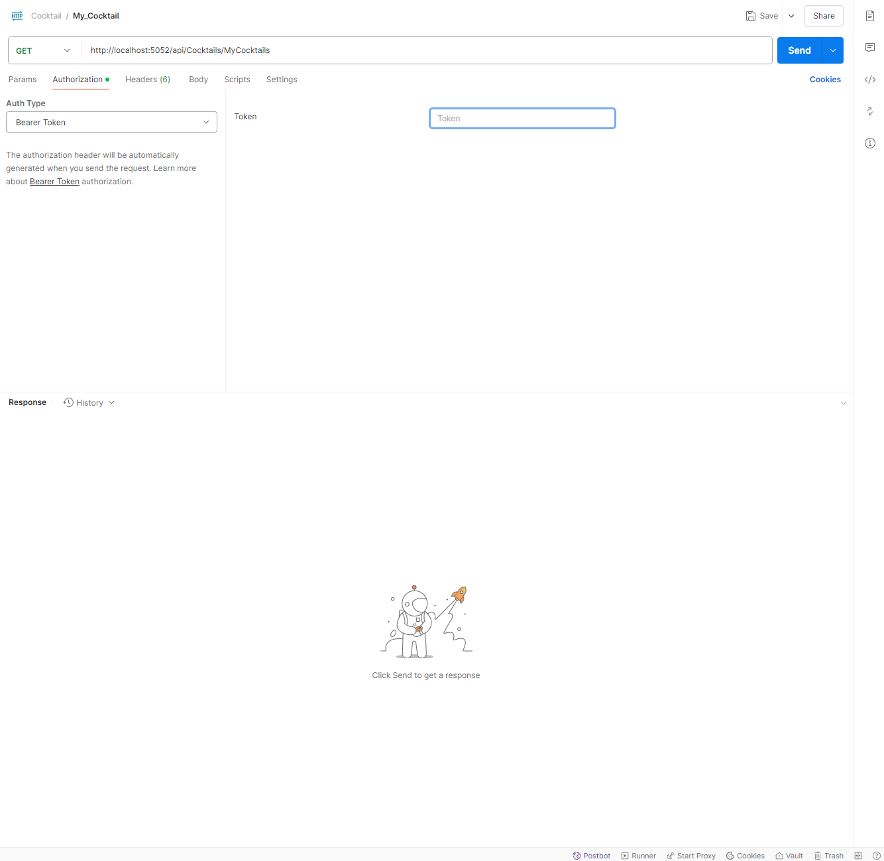

# API del progetto e come testarle su Postman


# Inserise i Token su postoman

# Autenticazione
## Alcune API richiedono un token JWT. Per aggiungerlo in **Postman**:
- Vai nella sezione `Authorization`
- Imposta `Auth Type` su **Bearer Token**
- Inserisci il token dell’utente nel campo `Token`



## 🍸 API Cocktail
- [GET - http://localhost:5052/api/Cocktails/cocktails](#get-all-cocktail)
- [GET - http://localhost:5052/api/Cocktails/cocktail/by-id](#cocktail-by-id)
- [GET - http://localhost:5052/api/Cocktails/search](#my-cocktails)
- [GET - http://localhost:5052/api/Cocktails/IngedientSearch/SearchIngredient](#)
- [GET - http://localhost:5052/api/Cocktails/SearchMeasureType/searchMeasure](#)
- [GET - http://localhost:5052/api/Cocktails/SearchGlass/searchGlass](#)
- [GET - http://localhost:5052/api/Cocktails/SearchCategory/searchCategory](#)
- [GET - http://localhost:5052/api/Cocktails/GetUserCocktailLikes](#)
- [GET - http://localhost:5052/api/Cocktails/GetCountCocktailLikes/{id}](#)
- [GET - http://localhost:5052/api/Cocktails/ingredients](#)
- [GET - http://localhost:5052/api/Cocktails/SearchUser/{username}](#)

- [POST - http://localhost:5052/api/Cocktails/CocktailCreate](#)
- [POST - http://localhost:5052/api/Cocktails/{id}/UploadImageCocktail-local](#)
- [POST - http://localhost:5052/api/Cocktails/{id}/UploadImageCocktail-url](#)

- [PUT - http://localhost:5052/api/Cocktails/CocktailUpdate/{idDrink}](#)

- [DELETE - http://localhost:5052/api/Cocktails/CocktailDelete/{idDrink}](#)

## 👤 API Users
- [GET - http://localhost:5052/api/Users/GetUser/{username}](#)
- [GET - http://localhost:5052/api/Users/check-token](#)
- [GET - http://localhost:5052/api/Users/GetToken](#)
- [GET - http://localhost:5052/api/Users/getPassword/{id}](#)
- [GET - http://localhost:5052/api/Users/GetMyCocktailLike/{id}](#)
- [GET - http://localhost:5052/api/Users/GetFollowedUsers/{id}](#)
- [GET - http://localhost:5052/api/Users/GetFollowersUsers/{id}](#)
- [GET - http://localhost:5052/api/Users/Get_Cocktail_for_Followed_Users](#)
- [GET - http://localhost:5052/api/Users/ThisYourCocktailLike/{id}](#)
- [GET - http://localhost:5052/api/Users/SuggestionsCocktailByUser/{id}](#)

- [POST - http://localhost:5052/api/Users/login](#)
- [POST - http://localhost:5052/api/Users/logout](#)
- [POST - http://localhost:5052/api/Users/register](#)
- [POST - http://localhost:5052/api/Users/upload-profile-image-local/{id}](#)
- [POST - http://localhost:5052/api/Users/upload-profile-image-Url/{id}](#)
- [POST - http://localhost:5052/api/Users/FollowedNewUser/{followedUserId}](#)

- [PUT - http://localhost:5052/api/Users/{id}](#)

- [DELETE - http://localhost:5052/api/Users/{id}](#)

## 🌍 API Translation
- [POST - http://localhost:5052/api/Translation/translate](#)


### Get All Cocktail

Restituisce **tutti i cocktail** presenti nel database come lista di oggetti `DTO`.

---

### Cocktail By Id

Restituisce un singolo cocktail, identificato da `id`.  
Se l’utente è autenticato e ha accettato i cookie, la ricerca viene **salvata nello storico personale** (`UserHistorySearch`).
Esempio:

```
/api/Cocktails/cocktail/by-id?id=12
```

---

### Search

Permette la ricerca avanzata di cocktail tramite **query param**:

| Parametro     | Descrizione                                  |
|---------------|----------------------------------------------|
| nameCocktail  | Nome del cocktail                            |
| UserSearch    | Username dell’utente creatore del cocktail   |
| glass         | Tipo di bicchiere                            |
| ingredient    | Ingrediente incluso                          |
| category      | Categoria del cocktail                       |
| alcoholic     | Alcoholic / Non Alcoholic / Optional alcohol |
| page          | Numero della pagina                          |
| pageSize      | Elementi per pagina                          |

> Può essere usata con uno o più filtri. Se viene usato solo `UserSearch`, restituisce **una lista di utenti**.

Esempio:
```
/api/Cocktails/search?ingredient=vodka&page=1&pageSize=10
```

---

### My Cocktails

Restituisce tutti i cocktail creati dall'utente attualmente autenticato.
Richiede [Token](#inserise-i-token-su-postoman).

---

### Ingredient Search

Suggerisce ingredienti filtrati in base alla stringa `ingredient`.  
Il risultato dipende dall'età dell’utente (`IsOfMajorityAge`):  
- minorenni: solo ingredienti analcolici
- maggiorenni: tutti
Esempio:
```
/api/Cocktails/IngredientSearch/SearchIngredient?id={userId}&ingredient={string}
```

---

### Search Measure

Suggerisce le unità di misura supportate (es: `ml`, `oz`, `dash`...).  
Filtro opzionale con il parametro `measure`.

```
/api/Cocktails/SearchMeasureType/searchMeasure?id={userId}&measure={string}
```
