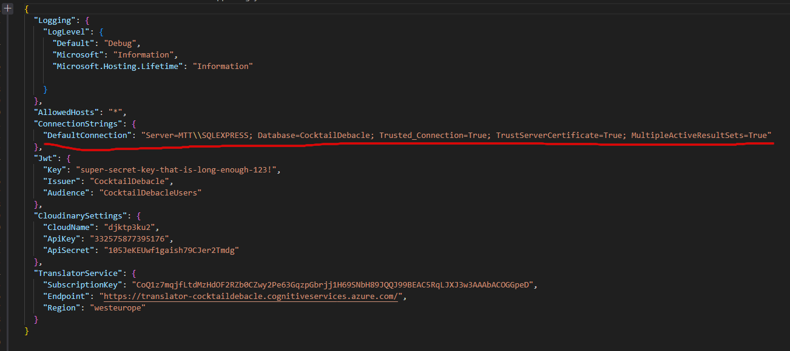

# 🍸 CocktailDebacle

🚀 **Progetto full-stack Angular + .NET + SQL Server orchestrato con Docker**

---

## 📦 Avvio del Progetto

È possibile **avviare l’intero progetto** dalla cartella `CocktailDebacle` tramite:

```bash
Questo comando esegue:
docker-compose up --build


⚙️ Modalità di Sviluppo
Durante lo sviluppo, i file Angular sono caricati staticamente da un container NGINX.
Per facilitare le modifiche front-end in tempo reale, si consiglia di usare questa modalità:

1. Avvio servizi backend e database su Docker
-docker-compose up sqlserver backend
✅ Questa modalità va utilizzata durante lo sviluppo.
Non è possibile lavorare dinamicamente sul frontend tramite docker.

2. Avvio frontend Angular in locale
-ng serve --host 0.0.0.0 --poll
 --poll è utile in ambienti dove il file watcher standard non funziona correttamente (es. WSL, Docker Volumes)

🔗 Connessione al Database
Per garantire che il frontend Angular comunichi col database nel container SQL Server, è necessario configurare correttamente la stringa di connessione in:
-CocktailDebacle.Server/appsettings.json




🧩 Struttura del Frontend (Angular Stand-alone)
Il frontend è realizzato con Angular stand-alone components (senza NgModules), e la loro comunicazione è gestita via:
-app.routes.ts

📸 Immagine:

🔄 Comunicazione tra componenti
I componenti comunicano tra loro tramite:

Input/Output

Servizi condivisi

Router con dati

📸 Immagine:

🔌 Chiamate API e Servizi
Le interazioni con il backend per utenti, cocktails, preferenze ecc. sono gestite da services Angular, ad esempio:
-user.service.ts
📸 Immagine:

📝 Validazione Sign-Up
La fase di registrazione utilizza Validators personalizzati per controllare:

Lunghezza minima/massima

Email valida

Password sicura

Username univoco

🌍 Traduzioni
Il servizio di traduzione utilizzato è Azure Translator
Limite gratuito: 2 milioni di caratteri/mese

Le traduzioni sono accessibili da:

⚙️ Impostazioni (dalla pagina Home)

📌 Footer:

WhoAreWe

Privacy

Help

🔐 Pagina Profilo (se loggati)

🌐 Pagina Browse Cocktails

📸 Immagine:

🍹 Browse dei Cocktails
🔍 Funzionalità di ricerca
| Ricerca per         | Disponibile per |
| ------------------- | --------------- |
| Cocktail alcolici   | Utenti loggati  |
| Cocktail analcolici | Tutti           |
| Ingredienti         | Loggati         |
| Persone             | Loggati         |


🎠 Caroselli dinamici
Suggerimenti personalizzati (se accettati i cookies)

Basati su età dell’utente

Descrizioni variabili in base a:

🕒 Ora del giorno: mattina / pomeriggio / sera

❄️☀️ Stagione


📸 Immagine:

🌗 È possibile switchare tra modalità giorno/notte cliccando sull’icona 🌞 / 🌙


📚 Sidebar di navigazione
Accessibile da:

Pagina Browse Cocktails

Pagina Profilo

Contiene:

🔍 Barra di ricerca

📄 Home

🍸 Browse

👤 Profilo

📸 Immagine:

👤 Pagina Profilo
Mostra:

👥 Persone seguite e follower

❤️ Like ai cocktails

📤 Cocktail creati (se pubblici)

📌 Cocktail piaciuti

📸 Immagine:

➕ Seguire un utente
Filtra ricerca per Utenti

Cerca il nome

Visualizza il profilo

Premi Segui / Smetti di seguire

📸 Immagine:

🛠️ Altre funzionalità del Profilo
✨ Creazione Cocktail
📸 Immagine:

❤️ Visualizzazione cocktail piaciuti
📸 Immagine:

🔧 Impostazioni
Modificabili:

🧑 Nome

📧 Email

🔐 Password

🆔 Username

⚠️ Username e password devono essere unici: in caso contrario viene restituito un errore.


| Componente | Stack                              |
| ---------- | ---------------------------------- |
| Frontend   | Angular 17, Stand-alone components |
| Backend    | .NET Core 7 API                    |
| DB         | SQL Server                         |
| Traduzioni | Azure Translator                   |
| Hosting    | Docker + NGINX                     |
-docker-compose up sqlserver backend
-ng serve --host 0.0.0.0 --poll

🔗 Controlla la stringa di connessione in appsettings.json
